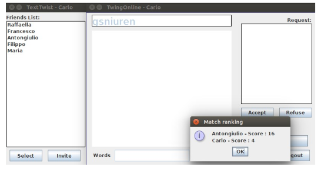

# Text-Twist
Project for the Networking Course in Bachelor Degree at University of Pisa

<h1> Description </h1>
Multiplayer online text-game with GUI. Made with Java and Swing.
For more details there is a<a href="Relazione.pdf">PDF</a>that explains everything in detail (Italian).

<h2>Logical scheme</h2>

<h2>How to Use</h2>
 
Double click on the files jar or from terminal with the command :java -jar TwistClient.jar/ TwistServer.jar. (Java 8 is required).

 
         Log panel will be the Friend Panel and a new panel will be added.To choose a friend just select him from the list, and after choosing all the friends, you can send the invitation to the game. In the second panel you can see the InviteList.

  
       The game starts after pressing OK

 
          The server will provide a sequence of letters. You can write the word in the space provided and press send. You can see all the words sent.

              Finisched the game a ranking is presented.
